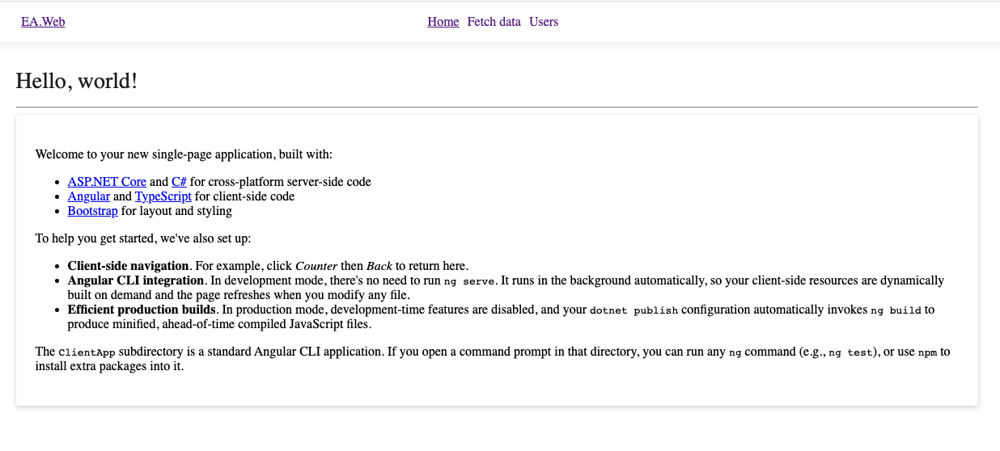
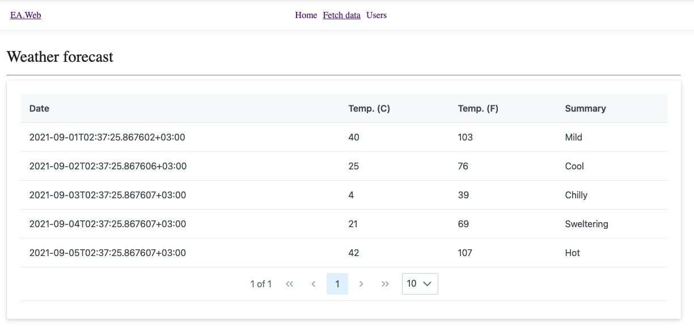
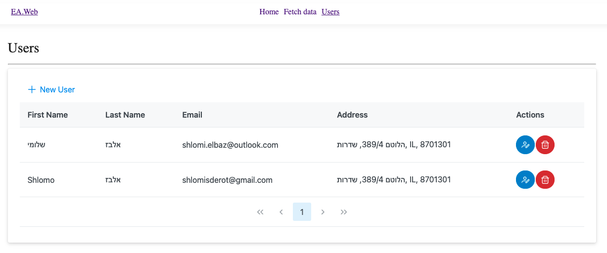

# Elbit Assignment
CRUD operation example rely on C# (server side) and Angular (client side). <br />
This sample use entity framework for SQLITE database, the DB includes in the code, the DB file can be found in folder EA.Data/Database/database.db <br /><br />


### Code Design:
From design aspect, although this is a small (very small) system there is a strict separation between the tiers of the system, 
while incoming messages from outside handling representing with ViewModel's and pass to the domain tier through the service tier.<br /><br />

Use of SOLID principles and design pattern such as: Dependency Injection, Decorators, Repository, Open/Close, 
Interface segregation and Dependency Inversion principles<br /><br />


## Project Structure:
-- EA.API - Represent the RESTFul API service, the middleware tire.<br />
-- EA.Data - Represent the database access tier.<br />
-- EA.Domain - Represent the application domain.<br />
-- EA.Service - Represent the service tier, the mediator between the API and the Domain.<br />
-- EA.Web - represent the front-end, the entry point.<br /><br />

### Execute the app using visual studio:
Just start the app, the project sets as a multiple startup projects (API and WEB).<br /><br />

### Execute the app without visual studio:
Get into LA.API project by using powershell and run the command: ```dotnet rum```.<br />
Get into LA.Web/ClientApp with CLI such as powershell/CMD and run the command: ```npm start```.<br /><br />


Note: the server and the client running on different PORTS, the CORS problem resolved by PROXY setting in package.json ("proxy": "http://localhost:5000").


The following is an snapshot's of the application:





